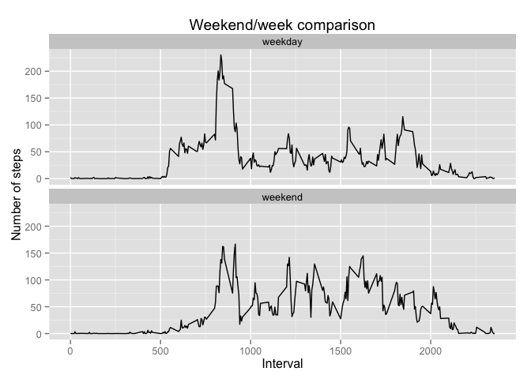

# Reproducible Research: Peer Assessment 1


## Loading and preprocessing the data

Unzip data and load in memory:

```r
echo <- TRUE
zipfile <- "./activity.zip"
unzippedfiles <- unzip(zipfile)
unzippedfile <- unzippedfiles[1] ## I know there is only one zipped file
data <- read.csv(unzippedfile)
```

Dates are strings, let's cast them into date types:

```r
data[,"date"] <- as.Date(data[,"date"], format = '%Y-%m-%d')
str(data)
```

```
## 'data.frame':	17568 obs. of  3 variables:
##  $ steps   : int  NA NA NA NA NA NA NA NA NA NA ...
##  $ date    : Date, format: "2012-10-01" "2012-10-01" ...
##  $ interval: int  0 5 10 15 20 25 30 35 40 45 ...
```

```r
head(data)
```

```
##   steps       date interval
## 1    NA 2012-10-01        0
## 2    NA 2012-10-01        5
## 3    NA 2012-10-01       10
## 4    NA 2012-10-01       15
## 5    NA 2012-10-01       20
## 6    NA 2012-10-01       25
```

## What is mean total number of steps taken per day?

Here is the bar chart of the total number of steps taken per day:

```r
table.date.steps <- aggregate(steps ~ date, data, sum)
hist(table.date.steps$steps,
     col=1, main="Histogram of total number of steps per day",
      xlab="Total number of steps in a day")
```

 

Calculation of the mean and median of the total number of steps:

```r
totalsteps.mean <- mean(table.date.steps$steps)
totalsteps.median <- median(table.date.steps$steps)
```

The stats on the total number of steps are:  
- Mean = 1.0766189\times 10^{4}  
- Median = 10765  

## What is the average daily activity pattern?

Average number of steps taken for each interval:

```r
table.interval.steps <- aggregate(steps ~ interval, data, mean)
plot(table.interval.steps$interval, table.interval.steps$steps, type='l', col=1, 
     main="Average number of steps taken for each interval", xlab="Intervals", 
     ylab="Average number of steps")
```

 

Calculation to identify the 5-minute interval, on average across all the days in the dataset, that contains the maximum number of steps:

```r
max.avg.steps.rowid <- which.max(table.interval.steps$steps)
row <- table.interval.steps[max.avg.steps.rowid, ]
row$interval
```

```
## [1] 835
```

```r
row$steps
```

```
## [1] 206.1698
```

The interval 835 has the maximum average number of steps (ie, 206.1698113)

## Imputing missing values

Calculation of the total number of rows with NAs:


```r
rowswithnona <- nrow(data[!complete.cases(data),])
```

There are 2304 rows with NAs.

Let's replace the NA values with the mean values for the corresponding 5-minute interval and create the resulting histogram of total number of steps in a day


```r
# replace the NA by the mean for that 5-minute interval
for (i in 1:nrow(data)){
  if (is.na(data$steps[i])){
    row_id <- which(table.interval.steps$interval == data$interval[i])
    data$steps[i] <- table.interval.steps$steps[row_id]
  }
}

# create histogram of total number of steps in a day
table.date.steps.imputed <- aggregate(steps ~ date, data, sum)
hist(table.date.steps.imputed$steps, col=1, main="(Imputed) Histogram of total number of steps per day", xlab="Total number of steps in a day")
```

 

Calculation of mean and median of the total number of steps taken per day:


```r
imputed.data.mean <- mean(table.date.steps.imputed$steps)
impted.data.median <- median(table.date.steps.imputed$steps)
```

The stats on the total number of steps imputing the the NAs are:  
- Mean = 1.0766189\times 10^{4}  
- Median = 1.0766189\times 10^{4}  

Replacing the NAs by the mean does not change the mean or the median (because the mean and the median had almost the same values in the first place)

## Are there differences in activity patterns between weekdays and weekends?
(Assumption: package ggplot2 already installed with install.packages("ggplot2"))

```r
## create a weekday/weekend factor
data$day.type <- "weekday"
for(i in 1:nrow(data)) {
  if (weekdays(data$date[i]) %in% c("Saturday", "Sunday")) {
    data$day.type[i] <- "weekend"
  }
}
library(ggplot2)
data$day.type <- as.factor(data$day.type)
imputed.interval.steps.table <- aggregate(steps ~ interval+day.type, data, mean)
p <- qplot(interval, steps, data=imputed.interval.steps.table, geom=c("line"),
      xlab = "Interval", ylab = "Number of steps", main="Weekend/week comparison")
p + facet_wrap(~ day.type, ncol=1)
```

 
